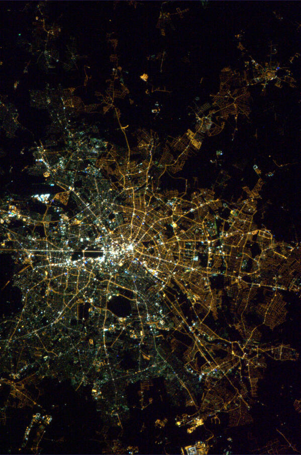

# Electromagnetic Sonification

This repository contains two files. First, a csv file containing results from a set of frequency sweeps in the 2.4GHz to 2.5 GHz band acquired using the HackRF One (Great Scott Gadgets) software defined radio and the [soapy_power](https://github.com/xmikos/soapy_power) utility. The second is an Ipython notebook containing the software for loading the frequency sweeps and converting them to an audio output. 

## Images

We want to attach EM sonifiers to lamp posts and use the lamp posts as sounding rods.

Photo from space showing how East + West Berlin look different from space.

A composite stitched together from screenshots from [http://osmstreetlight.bplaced.net/](http://osmstreetlight.bplaced.net/)

Benny's favorite Berlin lamp posts that hug the streets.

A scan of the 860-930MHz spectrum from Tayeb's Chicago apartment.

## Links

Link to FCC Chart: https://www.ntia.doc.gov/files/ntia/publications/2003-allochrt.pdf

Bundesnetzagentur version:
https://www.bundesnetzagentur.de/SharedDocs/Downloads/DE/Sachgebiete/Telekommunikation/Unternehmen_Institutionen/Frequenzen/20210114_Frequenzplan.pdf?__blob=publicationFile&v=3
